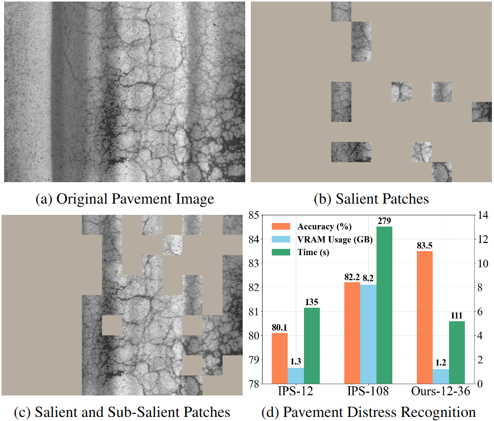
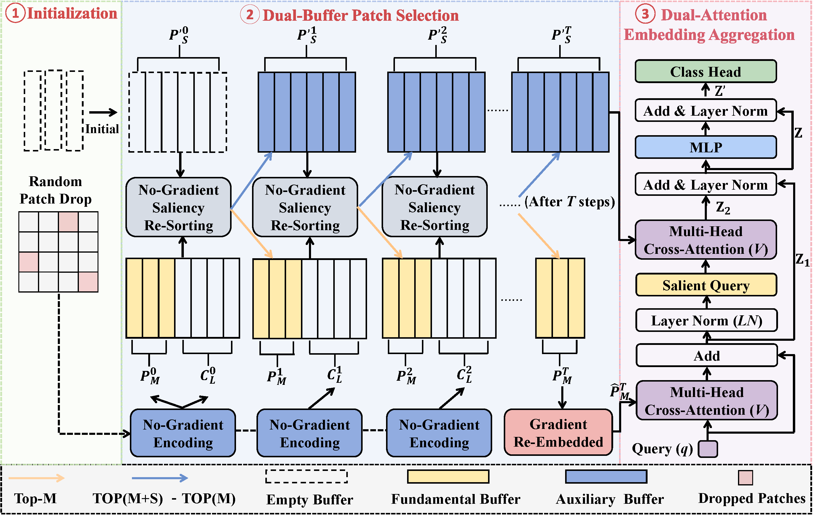

<h1 align="center"> No Pains, More Gains: Recycling Sub-Salient Patches for Efficient High-Resolution Image Recognition </h1>

  <a href="https://qinrong-nku.github.io/">Rong Qin</a>,
  <a href="https://xinliu29.github.io/">Xin Liu</a>,
  Xingyu Liu,
  Jiaxuan Liu,
  <a herf="https://jingleishi.github.io/">Jinglei Shi</a>,
  Liang Lin,
  <a href="https://cv.nankai.edu.cn/">Jufeng Yang</a>,

 CVPR 2025 

## Abstract

Over the last decade, many notable methods have emerged to tackle the computational resource challenge of the high resolution image recognition (HRIR). They typically focus on identifying and aggregating a few salient regions for classification, discarding sub-salient areas for low training consumption. Nevertheless, many HRIR tasks necessitate the exploration of wider regions to model objects and contexts, which limits their performance in such scenarios. To address this issue, we present a DBPS strategy to enable training with more patches at low consumption. Specifically, in addition to a fundamental buffer that stores the embeddings of most salient patches, DBPS further employs an auxiliary buffer to recycle those sub-salient ones. To reduce the computational cost associated with gradients of sub-salient patches, these patches are primarily used in the forward pass to provide sufficient information for classification. Meanwhile, only the gradients of the salient patches are back-propagated to update the entire network. Moreover, we design a Multiple Instance Learning (MIL) architecture that leverages aggregated information from salient patches to filter out uninformative background within sub-salient patches for better accuracy. Besides, we introduce the random patch drop to accelerate training process and uncover informative regions. Experiment results demonstrate the superiority of our method in terms of both accuracy and training consumption against other advanced methods.

## DBPS Pipeline

  

We firstly divide the high-resolution image into image patches and randomly drop some of them. Next, we initial two buffers $P_M^{0}$ and $P'^{0}_{S}$, and iteratively update them in no-gradient mode to find the most salient patches and the sub-salient patches. After patch selection, $P_M^{T}$ is embedded again in gradient mode, and then input into the cross-attention layer to be aggregated. The aggregated embedding can be denoted as the salient query for the better aggregation of no-gradient $P'^{t}_{S}$.

## 1. Requirements

Python 3.8+, Pytorch 1.9.0, Cuda 11.1, , opencv-python

## 2. Training & Testing

- Train the model on CAMELYON16 dataset:

    `python c16_main1.py`
 
- Train the model on the other five datasets:

    `python main1.py`/`python main2.py`

- Set experiment settings:
     
    browse `config` folder

    
