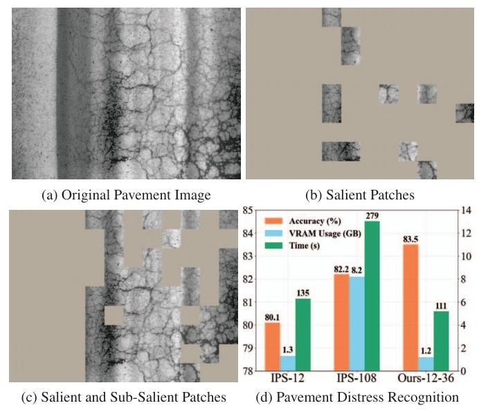
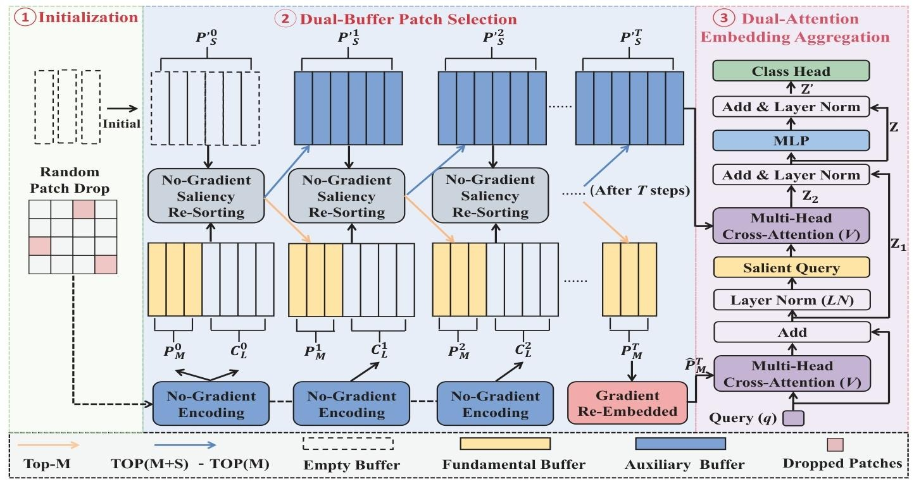
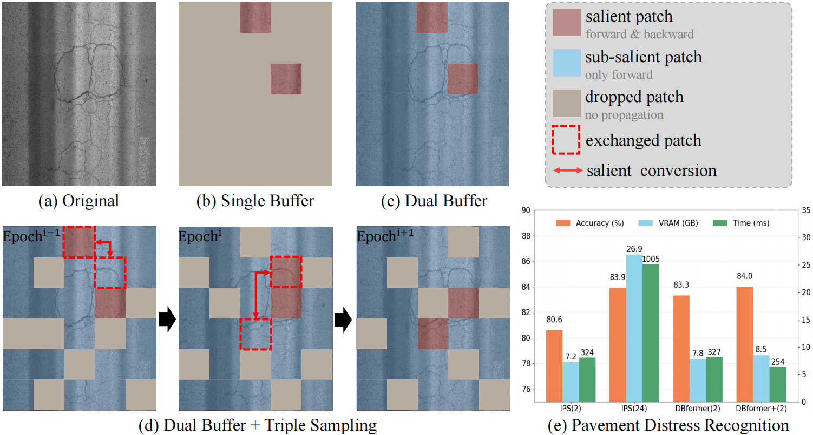
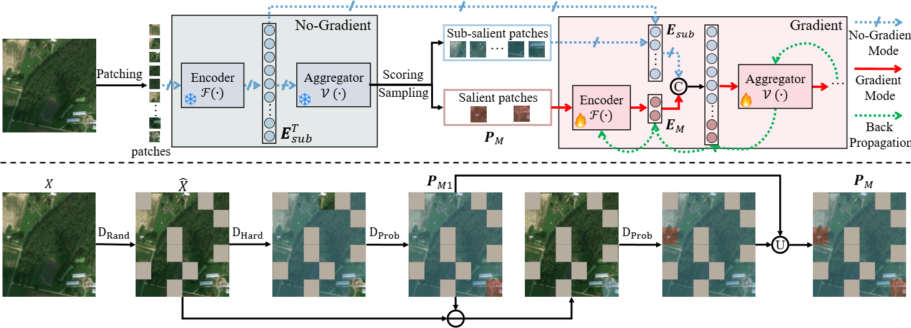

<div align=center>
    <h1>No Pains, More Gains:</br>
Recycling Sub-Salient Patches for Efficient High-Resolution Image Recognition </h1>

[**Rong Qin**](https://qinrong-nku.github.io/), [**Xin Liu**](https://xinliu29.github.io/), **Xingyu Liu**, **Jiaxuan Liu**, **Jinglei Shi**, **Liang Lin**, [**Jufeng Yang<sup>†</sup>**](https://cv.nankai.edu.cn/)

[CVPR 2025](https://ieeexplore.ieee.org/document/11094757) 
</div>

## Abstract


Over the last decade, many notable methods have emerged to tackle the computational resource challenge of the high resolution image recognition (HRIR). They typically focus on identifying and aggregating a few salient regions for classification, discarding sub-salient areas for low training consumption. Nevertheless, many HRIR tasks necessitate the exploration of wider regions to model objects and contexts, which limits their performance in such scenarios. To address this issue, we present a DBPS strategy to enable training with more patches at low consumption. Specifically, in addition to a fundamental buffer that stores the embeddings of most salient patches, DBPS further employs an auxiliary buffer to recycle those sub-salient ones. To reduce the computational cost associated with gradients of sub-salient patches, these patches are primarily used in the forward pass to provide sufficient information for classification. Meanwhile, only the gradients of the salient patches are back-propagated to update the entire network. Moreover, we design a Multiple Instance Learning (MIL) architecture that leverages aggregated information from salient patches to filter out uninformative background within sub-salient patches for better accuracy. Besides, we introduce the random patch drop to accelerate training process and uncover informative regions. Experiment results demonstrate the superiority of our method in terms of both accuracy and training consumption against other advanced methods.

<!-- 清除悬浮，避免后续内容受影响 -->
<div style="clear: both;"></div>


## DBformer Pipeline
<p align="center">
  
</p>

We firstly divide the high-resolution image into image patches and randomly drop some of them. Next, we initial two buffers $P_M^{0}$ and $P_S^{P0}$, and iteratively update them in no-gradient mode to find the most salient patches and the sub-salient patches. After patch selection, $P_M^T$ is embedded again in gradient mode, and then input into the cross-attention layer to be aggregated. The aggregated embedding can be denoted as the salient query for the better aggregation of no-gradient $P_S^{at}$.

<div style="border-top: 5px dotted #666; margin: 20px 0;"></div>


<div align=center>
    <h1>Breaking the Context-Cost Trade-off in High-Resolution Image Recognition via Recycling Sub-Salient Patches </h1>

[**Rong Qin**](https://qinrong-nku.github.io/), **Yao Liu**, [**Xin Liu**](https://xinliu29.github.io/), **Jianyuan Guo**, **Jin Wu**, **Chi-Man Vong**, **Liang Lin**, [**Jufeng Yang<sup>†</sup>**](https://cv.nankai.edu.cn/)


[Extended version]

<!--  -->
</div>

## Abstract


In high-resolution image recognition (HRIR) tasks, high-resolution input offer fine-grained details essential for accurate prediction, but they also introduce significant computational overhead. 
To mitigate this detail–cost trade-off, existing approaches often adopt a single buffer strategy that retains only a few high-scoring salient patches for training, while discarding the rest to save corresponding cost. 
However, context from broader regions is equally crucial for robust object modeling and effective optimization, giving rise to a new *context–cost trade-off* that prior strategies fail to address. 
To tackle this challenge, we propose a dual-buffer framework that simultaneously preserves comprehensive context and achieves efficient training.
Specifically, beyond a static buffer that retains the most salient patches, we introduce a dynamic buffer that recycles contextual embeddings from sub-salient regions. 
We further propose a novel hybrid propagation strategy, in which the sub-salient embeddings from the dynamic buffer participate in the forward pass to supply context cues, but are detached from gradient computation so that backpropagation updates only the salient patches. 
This reduces gradient computation cost while preserving predictive performance.
To further enable direct learning from sub-salient regions, we develop a triple sampling strategy that integrates random, hard score-based, and probabilistic sampling.
This design reduces overfitting resulting from relying on limited regions for optimization, accelerates patch selection, and ensures gradient flow from diverse patches.
Extensive experiments on six HRIR benchmarks, ranging from megapixel to gigapixel images, demonstrate that our method achieves superior accuracy while significantly lowering training cost.  


## DBformer+ Pipeline

First, as shown in the upper row, the dual buffer strategy uses a dynamic buffer $\boldsymbol{E}_{\text{sub}}$ to store the no-gradient features of sub-salient patches, while the salient patches will be stored in a static buffer $\boldsymbol{P}_M$. The $\boldsymbol{P}_M$ will then be re-encoded into $\boldsymbol{E}_M$ in gradient mode and concatenated with no-gradient $\boldsymbol{E}_{\text{sub}}$ for hybrid propagation. In addition, as shown in the bottom row, the triple sampling strategy first employs random sampling to drop a portion of the patches to accelerate training. Then, a probability sampling operation is performed within the top-scoring patch set, followed by another probability sampling among the remaining patches. The union of the two probability sampling results constitutes the final salient patches.

<p align="center">
  
</p>


***
<!-- | Dataset | Description | Resolution | Classes | Images |
|---------|------------|------------|---------|---------|
| Megapixel MNIST | Handwritten digits | 1024×1024 | 10 | 70,000 |
| Traffic Signs | Traffic sign detection | 2048×2048 | 43 | 50,000 |
| CQU BPDD | Medical pathology | 1000×1000 | 2 | 2,438 |
| Eyes Dataset | Eye disease diagnosis | 2048×1536 | 4 | 88,000 |
| XBD | Natural disaster assessment | 1024×1024 | 4 | 22,068 |
| Camelyon16 | Cancer metastasis detection | 100k×100k | 2 | 400 | -->


## Project Structure

```
├── architecture/          # Model architecture definitions
│   ├── DBformer.py       # Main model architecture
│   ├── transformer.py    # Transformer modules
│   ├── abmil.py          # Attention-based MIL
│   └── ...              # Other architecture components
├── new_config/           # Configuration files
│   ├── cqu_bpdd_db+.yml  # CQU BPDD dataset config
│   ├── eyes_db+.yml       # Eye dataset config
│   └── xbd_db+.yml       # XBD dataset config
├── data/                 # Dataset processing
│   ├── megapixel_mnist/ # Megapixel MNIST dataset
│   ├── traffic/         # Traffic signs dataset
│   ├── camelyon/        # Medical image dataset
│   └── downstream_data.py # Downstream task datasets
├── training/            # Training-related code
│   ├── iterative.py     # Iterative training logic
│   └── vis_iter_test.py # Visualization testing
├── utils/              # Utility functions
│   └── utils.py        # General utility functions
├── main_new.py         # Main program entry point
└── README.md          # Project documentation
```

## Experimental Results
### Attention visualization
<div align="center">  </div>

### Experimental results on Swedish Traffic Signs datasets
<!-- `DBformer` refers to our conference version, which only incorporates the dual buffer strategy. `DBformer+` refers to our latest version, which combines the triple sampling strategy and a new aggregator.`$N^{\prime}$` represents the number of randomly sampled patches used for training.`$M$` represents the number of salient image patches used for training.`NA` indicates that the corresponding value is unavailable for the method.Our methods are marked with a light blue background: $\colorbox{lightblue}{\text{blue}}$. -->
<div align="center">  </div>

### Experimental results on the megapixel HRIR tasks
<div align="center">  </div>

### Experimental results on the gigapixel Cpath tasks
<div align="center">  </div>

##  Quick Start

```bash
python main_new.py --dataset cqu_bpdd --config new_config/cqu_bpdd_db+.yml
```

- `--dataset`: Specify dataset type (mnist, traffic, cqu_bpdd, eyes, xbd, etc.)
- `--config`: Specify configuration file path

### Getting the data
- Swedish Traffic Signs Recognition: Later
- CQU BPDD: [Download](https://github.com/DearCaat/CQU-BPDD)
- Eyes Dataset: Later

- Camelyon16: Later


In addition,we have newly created an XBD subset, which contains 4 types of images and is mainly used for disaster level assessment:
- XBD: Coming soon

### Configuration File 

Configuration files use YAML format and mainly contain the following important sections:

```yaml
# Model configuration
enc_type: 'resnet18'          # Encoder type
attention: 'ABX'              # Attention type
shuffle_style: 'batch'        # Shuffling style: 'batch' or 'instance'
sample_style: 'Half'          # Sampling style: 'Hard', 'prob' or 'half'
M: 2                          # Salient patch number

# Training configuration
n_epoch: 100                  # Number of training epochs
B_seq: 32                 # Batch size
lr: 0.001                 # Learning rate
lrs: False                     # Whether to use lrs (erforms salient patch selection on the low-resolution image)

# Dataset configuration
dataset_path: "/path/to/dataset"

# Monitoring configuration
wandb: true               # Enable WandB monitoring
swanlab: false            # Enable SwanLab monitoring
```

You can refer to the files in the shared configuration file directory `config/` for modifications.

## Citing 
If you find the code useful, please consider citing:
```bibtex
@inproceedings{qin2025no,
  title={No Pains, More Gains: Recycling Sub-Salient Patches for Efficient High-Resolution Image Recognition},
  author={Qin, Rong and Liu, Xin and Liu, Xingyu and Liu, Jiaxuan and Shi, Jinglei and Lin, Liang and Yang, Jufeng},
  booktitle={Proceedings of the Computer Vision and Pattern Recognition Conference},
  pages={14965--14975},
  year={2025}
}
```
